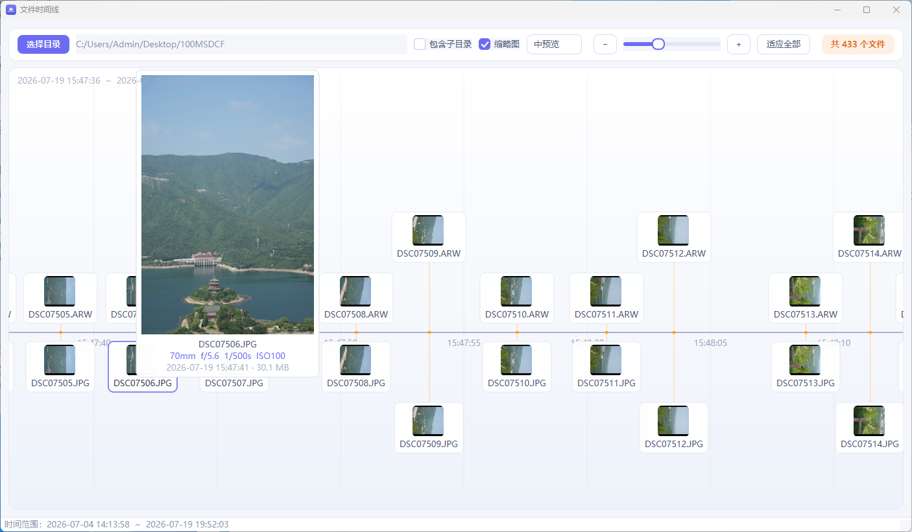

# fileTimeline

English | **[中文](README.md)**

A Qt desktop tool that lays the files of a folder out on a **zoomable, pannable timeline** by their modification time — browse your files (especially photos) along a time axis.



## Features

- Files are plotted by modification time (ties broken by file name); subdirectories optional
- Wheel-zoom anchored at the cursor, drag to pan — from single milliseconds to years
- Thumbnail cards for images, with a large hover preview in three selectable sizes
- Camera **RAW** files (ARW/CR2/NEF/DNG/ORF/RW2/RAF/PEF/SR2) use the embedded preview JPEG instead of decoding the whole file — friendly to SMB/network shares; camera **JPEGs** prefer the EXIF embedded thumbnail
- Hover preview shows shooting parameters parsed from EXIF: focal length / aperture / shutter / ISO
- Double-click to open a file with the system default app; non-image files are color-coded by extension

## Build

Requires Qt 6.7 (qmake) and MinGW 64-bit on Windows.

```bash
qmake fileTimeline.pro
mingw32-make
```

Or simply open `fileTimeline.pro` in Qt Creator and build.

## Layout

```
src/         source code
resources/   icons and Qt resources
docs/        docs and screenshots
```

## License

[GPL-3.0](LICENSE)
